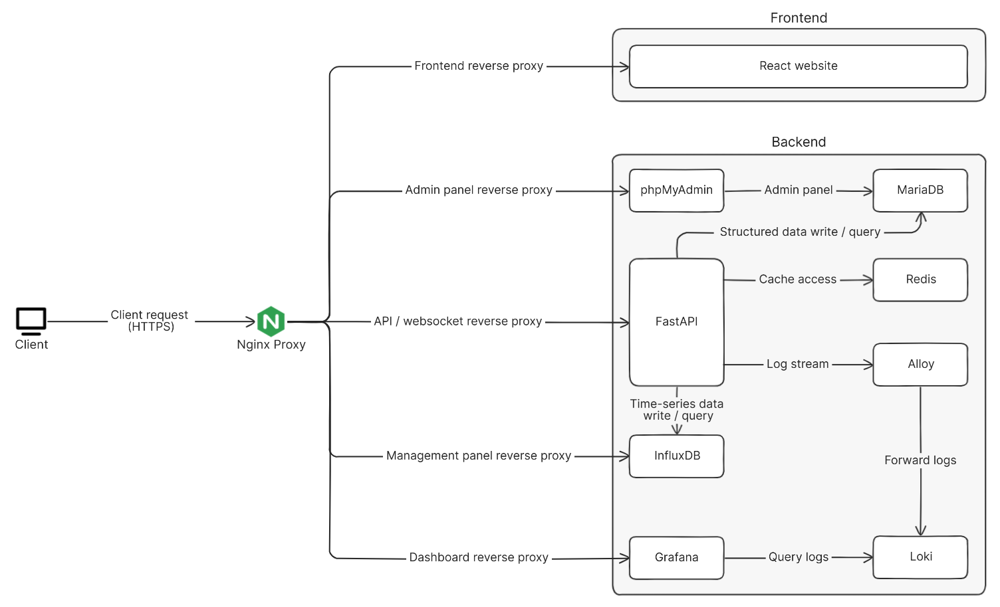

# User Manual

This project is responsible for managing and integrating the user manuals for the system.


## Features

- ⚛️ **Frontend**: Built with React, offering a fast and modern user interface.
- 🚀 **Backend**: Powered by FastAPI, providing a robust and flexible API layer.
- 🛢️ **Database**: Uses MariaDB for reliable and high-performance data storage.
- 🗄️ **Database Management**: phpMyAdmin for MariaDB database management.
- 📈 **Time Series Database**: InfluxDB provides efficient storage and retrieval of time-series data.
- 🔀 **Reverse Proxy**: Nginx serves as a reverse proxy, efficiently routing traffic to the appropriate services.
- 📊 **Log Management**: Grafana provides log visualization and monitoring dashboards.
- ⚙️ **CI/CD Testing**: Automated testing with GitLab CI and coverage reporting.
- 🐳 **Dockerized**: All services are containerized with Docker Compose for easy deployment.


## System Architecture



## System Requirements

| Component | Version | Description |
|-----------|---------|-------------|
| Ubuntu | 24.04.1 LTS | Operating System |
| Docker | 27.2.0 | Containerization Platform |
| Node.js | 20.18.0 | For VAPID key generation |


## How to Use

#### 1. **Clone the repository**

   ```bash
   git clone ssh://git@172.16.0.206:2224/it/user-manual.git
   ```


#### 2. **Move to project**

   ```bash
   cd user-manual
   ```


#### 3. **Configure environment variables**

   Copy `.env.example` to `.env` and edit as needed:

   ```bash
   cp .env.example .env
   ```

   Edit the `.env` file and configure the following settings:

   - **Keycloak Authentication Settings**
   
      Set the following parameters based on [step 4](#4-set-up-keycloak-authentication):
      
      ```bash
      KEYCLOAK_SERVER_URL=keycloakServerURL
      KEYCLOAK_REALM=keycloakRealm
      KEYCLOAK_CLIENT=keycloakClient
      KEYCLOAK_ADMIN_CLIENT=keycloakAdminClient
      KEYCLOAK_ADMIN_CLIENT_SECRET=keycloakAdminClientSecret
      KEYCLOAK_SUPER_ROLE=keycloakSuperRole
      ```

   - **Web Push Settings**
   
      Set the following parameters using the VAPID keys you generated in [step 5](#5-generate-vapid-keys-for-web-push-notifications):
      
      ```bash
      VAPID_PRIVATE_KEY=VAPIDPrivateKey
      VAPID_PUBLIC_KEY=VAPIDPublicKey
      VAPID_EMAIL=VAPIDPEmail
      ```

   - **Development and Production Modes**

      Set the `COMPOSE_FILE` environment variable to switch between development and production modes.


#### 4. **Set up Keycloak Authentication**

   Configure your Keycloak instance and obtain the required configuration values:

   - **`KEYCLOAK_SERVER_URL`** : Your Keycloak server address

   - **`KEYCLOAK_REALM`** : Login to Keycloak Admin Console → Select your Realm name from the top-left dropdown

   - **`KEYCLOAK_CLIENT`** : In your Realm → Clients → Select the Client ID you want to use

   - **`KEYCLOAK_ADMIN_CLIENT`** : A client with administrative privileges, typically found in the Clients list with admin-related permissions. Default is usually `admin-cli`

   - **`KEYCLOAK_ADMIN_CLIENT_SECRET`** : Navigate to Admin Client → Credentials tab to find the Secret value
   
   - **`KEYCLOAK_SUPER_ROLE`** : Set the name of the super role for your system


#### 5. **Generate VAPID keys for Web Push notifications**

   Install web-push globally and generate VAPID keys:

   ```bash
   npm install -g web-push
   ```

   ```bash
   web-push generate-vapid-keys
   ```


#### 6. **Set up Nginx SSL certificates and IP whitelist**
  
   - To enable SSL (HTTPS), you need to configure SSL settings in your `.env` file and place your SSL certificates in the `nginx/ssl` directory.
      - Env setting: 
         ```bash
         SSL_ENABLE=true
         SSL_CERT_FILE=cert.pem
         SSL_KEY_FILE=privkey.pem
         ```

      - Place your certificates in the `nginx/ssl` directory:
         ```bash
         nginx/ssl/
         ├── cert.pem       # Your SSL certificate
         └── privkey.pem    # Your private key
         ```
   - Copy `whitelist.conf.example` to `whitelist.conf` and edit as needed.

      ```bash
      cp nginx/whitelist.conf.example nginx/whitelist.conf
      ```
  
   > See [Nginx Docs](./nginx/README.md) for more details.


#### 7. **Start the services**

   First run or after code changes:

   ```bash
   docker compose up -d --build
   ```

   Subsequent runs (no code changes):

   ```bash
   docker compose up -d
   ```


#### 8. **Stop the services**

   ```bash
   docker compose down
   ```

## Documentation

| Directory    | Link                            |
|--------------|---------------------------------|
| Frontend     | [Docs](./frontend/README.md)    |
| Backend      | [Docs](./backend/README.md)     |
| Nginx        | [Docs](./nginx/README.md)       |
| CICD         | [Docs](./.gitlab/README.md)     |


## License

This project is licensed under the [MIT License](./LICENSE).